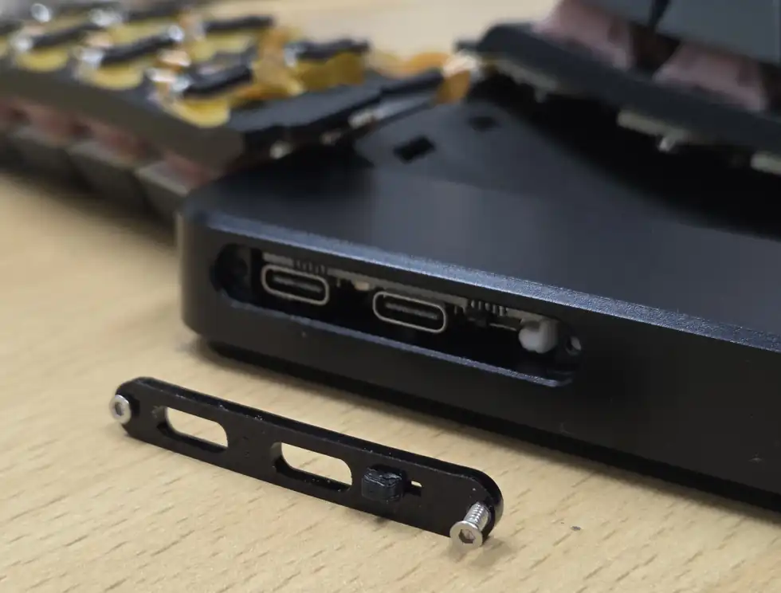
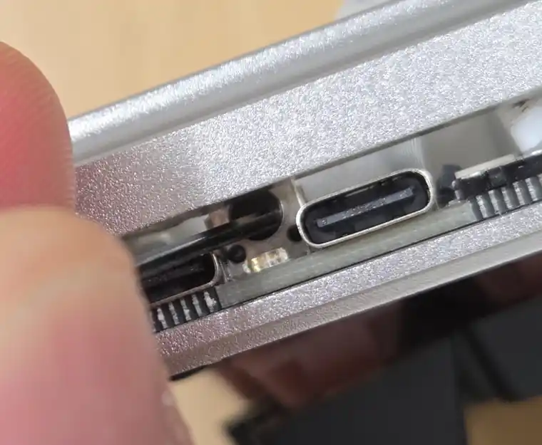

# 리셋 버튼으로 펌웨어 초기화하기

펌웨어 파일을 다시 넣으려면 사이드 커버를 열고 PCB의 리셋 버튼을 눌러야 합니다.

사이드 커버를 탈착할 때 과도한 힘을 가하면 커버나 결합부가 파손될 수 있습니다. 천천히 힘을 나누어 열어 주세요.

1. MODU-C를 USB 케이블로 PC에 연결합니다.
2. 사이드 커버를 조심해서 분리합니다.

   

3. PCB의 리셋 버튼을 빠르게 두 번(따닥) 누릅니다.

   

4. PC에 `MODU_BOOT` 드라이브가 나타나는지 확인합니다.
